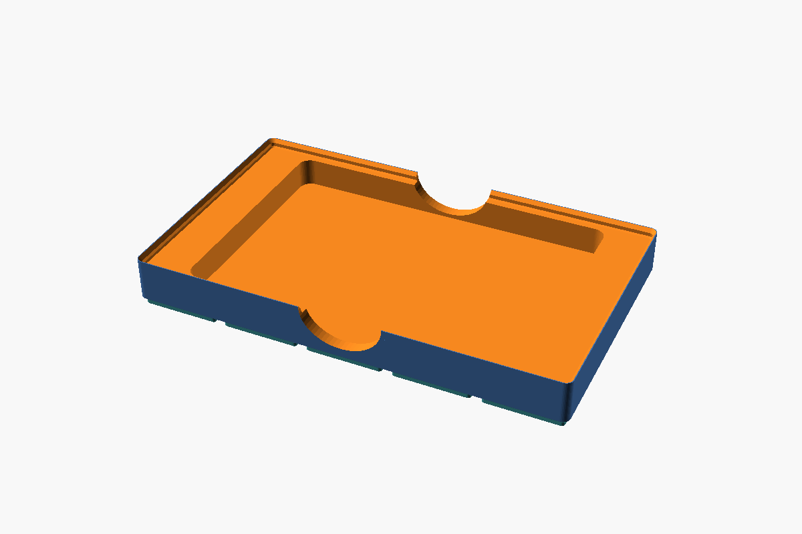

# Gridfinity Kobo Storage

A Gridfinity bin that keeps a **Kobo Clara Color** lying flat in a drawer.



## What's here

| File | What it is |
| --- | --- |
| `kobo_bin.scad` | Parametric OpenSCAD source (no external libraries needed) |
| `stl/kobo_bin_5x3x3.stl` | Ready-to-print STL with the default settings |

## Measurements used

| What | Value |
| --- | --- |
| Kobo Clara Color in its cover | 160 × 111 × 9.65 mm measured; sized for 161 × 112 mm to allow for ruler error |
| Pocket (1 mm clearance per side) | 163 × 114 mm, 6 mm corner radius |
| Bin footprint | 5 × 3 grid units, 209.5 × 125.5 mm |
| Bin height | 3 units (21 mm) + 4.4 mm stacking lip = 25.4 mm |
| Pocket depth | 14 mm from the floor to the rim (18.4 mm to the top of the lip) |
| Drawer inside height | 57 mm |

Height budget in the drawer: about 5 mm of baseplate + 25.4 mm of bin leaves roughly
26 mm of headroom. The tallest bin that still fits is 6 units (5 + 42 + 4.4 = 51.4 mm).

Two finger notches in the long walls let you pinch the reader out. They stop 2 mm
above the pocket floor.

## Customising

Open `kobo_bin.scad` in OpenSCAD and use the Customizer panel (Window > Customizer).
Useful knobs:

- `clearance`: loosen or tighten the fit after a test print.
- `device_thickness`: add the thickness of a sleep cover if you store it in one.
- `height_units`: up to 6 for a 57 mm drawer.
- `stacking_lip`: turn off for a flat rim.

Export with F6 (render) and then File > Export > STL, or from the command line:

```sh
openscad -o stl/kobo_bin_5x3x3.stl kobo_bin.scad
```

## Printing

- Print upright (feet down); no supports needed.
- 0.2 mm layers, 3 walls, 15 % infill is plenty.
- A felt or TPU pad on the pocket floor adds extra protection for the screen.
